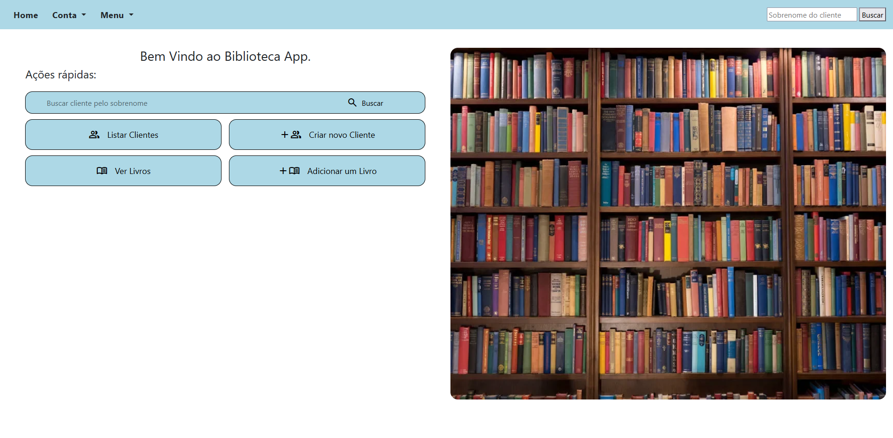
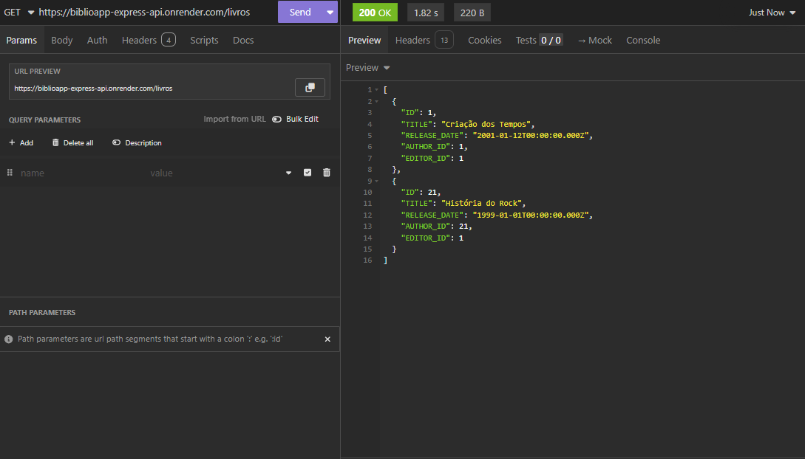
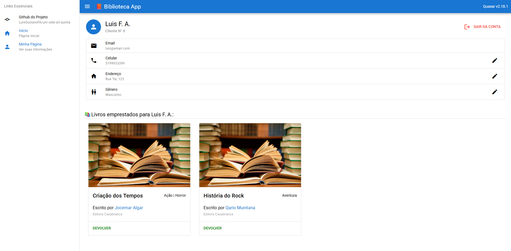

<p align="right">
  <a href="README.md">🇺🇸 English</a>
</p>

# biblioApp

**biblioApp** é uma aplicação full-stack de gerenciamento de biblioteca, construída com múltiplas tecnologias modernas e organizada como um monorepo. O projeto demonstra a integração de um backend em Django com banco de dados Oracle, uma API REST em Node.js/Express para autenticação e regras de negócio, e um frontend em Quasar/Vue.js.

A aplicação permite que usuários se autentiquem usando Google Firebase, naveguem e filtrem livros e autores, realizem empréstimos de livros e gerenciem informações pessoais da conta.

---

## Visão Geral da Arquitetura

O projeto é composto por três serviços independentes, porém conectados:

```
biblioApp/
├── biblioApp-django-app    # Django + Oracle DB (Admin & dados centrais)
├── biblioApp-express-api   # API REST Express.js (Autenticação & integração)
└── biblioApp-quasar-front  # Frontend Quasar / Vue.js
```


Cada serviço pode ser desenvolvido e executado de forma independente, mas juntos formam o ecossistema completo do **biblioApp**.

---

## Principais Funcionalidades

* Login e Cadastro com **Firebase Authentication**
* Autenticação e autorização baseadas em JWT
* Navegação por livros e autores
* Filtro de livros por autor
* Empréstimo de livros
* Atualização de informações do usuário (email, telefone, endereço, etc.)
* Interface administrativa para gerenciamento da biblioteca
* Integração com Oracle Autonomous Database

---

## 1. biblioApp-django-app

Aplicação Django responsável pelo gerenciamento dos dados centrais, interface administrativa e integração com o banco de dados Oracle.



### Tecnologias

* Django 5
* Django REST Framework
* Oracle Autonomous Database (suporte ao plano Always Free)
* Gunicorn & WhiteNoise (configuração pronta para produção)

### Requisitos

Crie um **ambiente conda** e instale as seguintes dependências:

```
Django==5.0.3
asgiref==3.8.1
djangorestframework==3.16.0
django-filter==25.1
django-widget-tweaks==1.5.0
oracledb==3.1.1
python-decouple==3.8
Markdown==3.8
cryptography==45.0.3
cffi==1.17.1
pycparser==2.22
pillow==10.3.0
gunicorn==21.2.0
whitenoise==6.6.0
requests>=2.31.0
```

### Configuração de Ambiente

Crie um arquivo `.env` na raiz de `biblioApp-django-app`:

```
SECRET_KEY=your_django_secret_key
DEBUG=True
DB_NAME=your_oracle_tns_high
DB_USER=admin
DB_PASSWORD=your_db_password
```

### Executando a Aplicação

Aplique as migrações:

```
python manage.py migrate
```

Inicie o servidor de desenvolvimento:

```
python manage.py runserver
```


### Nota sobre Controle de Acesso

O cadastro de usuários está atualmente aberto e todos os usuários autenticados possuem acesso completo às funcionalidades da aplicação.
Esse comportamento é intencional para fins de demonstração acadêmica.

Em um cenário de produção, seria aplicado controle de acesso baseado em papéis (RBAC) para separar permissões administrativas e de usuários comuns.

---

## 2. biblioApp-express-api

API REST construída com Express.js. Este serviço é responsável pela autenticação, validação de JWT, integração com o Firebase e comunicação com o banco de dados Oracle.



### Tecnologias

* Node.js
* Express.js
* Firebase Authentication
* JWT
* Oracle Database

### Configuração de Ambiente

1. Crie um **Google Firebase Web App**.
2. Obtenha o `firebaseConfig` em:
   **Firebase Console → Configurações do Projeto → Geral**.
3. Crie um arquivo `secrets.js` na raiz de `biblioApp-express-api`:

```js
import { createSecretKey } from "crypto";

const secret = "anyString";

export const jwtSecret = createSecretKey(secret, "utf-8");

export const oracleSecrets = {
  user: 'admin',
  password: 'sua_senha_do_banco',
  connectString: 'seu_tns_high_oracle'
};

export const firebaseSecrets = {
  apiKey: "sua_api_key",
  authDomain: "seu_auth_domain",
  projectId: "seu_project_id",
  storageBucket: "seu_storage_bucket",
  messagingSenderId: "seu_sender_id",
  appId: "seu_app_id"
};
```

### Executando a API

Instale as dependências:

```
npm install
```

Inicie o servidor:

```
npm run start
```

---

## 3. biblioApp-quasar-front

Aplicação frontend construída com Quasar Framework e Vue.js, responsável pela interface e experiência do usuário.



### Tecnologias

* Vue.js
* Quasar Framework
* Axios

### Configuração

Antes de executar a aplicação:

* Atualize os endereços base do Axios para apontar para sua API Express em execução.

### Executando o Frontend

Instale as dependências:

```
npm install
```

Inicie o servidor de desenvolvimento:

```
quasar dev
```

---

## Notas de Desenvolvimento

* Todos os serviços devem estar em execução para funcionalidade completa.
* A autenticação via Firebase é necessária para login e cadastro.
* O Oracle Autonomous Database (Always Free) é recomendado para desenvolvimento.
* Os arquivos de ambiente (`.env`, `secrets.js`) nunca devem ser versionados.

---

## Licença

Este projeto é destinado a fins educacionais e acadêmicos. Informações de licença podem ser adicionadas conforme necessário.

---

## Autor

Desenvolvido como um projeto acadêmico full-stack para explorar arquiteturas web modernas, fluxos de autenticação e integração com bancos de dados.
